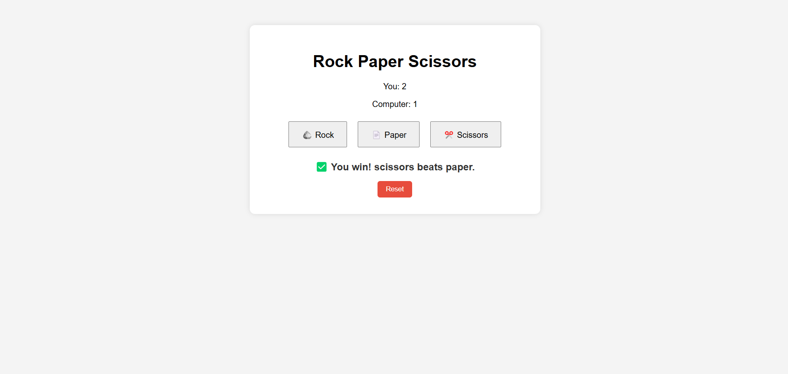

# Rock Paper Scissors 🎮

A fun and interactive Rock Paper Scissors game built with HTML, CSS, and JavaScript.

## 🖥️ Demo

## 🚀 Live Demo
Check out the game live at:  
[Live Demo - Rock Paper Scissors Game](https://degala-hari-krishna.github.io/rock-paper-scissors-game/)

## 🚀 Features
- Clean UI with emojis
- Live score tracking
- Reset functionality
- Responsive design
- Clear result messages (win/lose/draw)

## 📂 Folder Structure
rock-paper-scissors-game/
├── index.html
├── style.css
├── script.js
└── README.md

## 📸 Screenshot

screenshot.png

## 🛠️ Tech Used
- HTML5
- CSS3
- JavaScript (DOM)

## 💡 Future Improvements
- Add sound effects 🎵
- Track rounds and history 📊
- Add animations ✨

---

## 📬 Connect with Me
- 💌 harikrishna69322@gmail.com
- 🔗 [LinkedIn](https://www.linkedin.com/in/degala-hari-krishna-6430b526a/)

---
